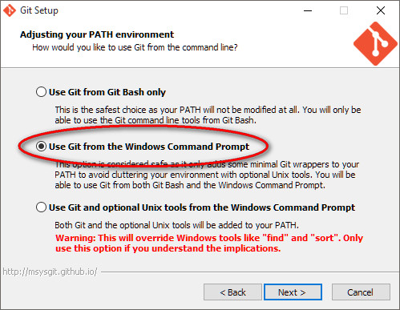

Repository for the Example Build project. Made in Cinder.


Requirements for Windows
========================
  * A Git client for your operating system (see below).
  * Microsoft Visual Studio 2013 Community (or Pro / Express) for Desktop (installer can be found in the 'tools' folder).
  * Inno Setup 5 (installer can be found in the 'tools' folder).


You can download the Git installer here:
http://git-scm.com/downloads

Make sure to enable running Git from the command line. This choice is offered by the installer, but not set by default.



How to use this repository?
===========================
  1. Install the Git client for Windows or Mac OSX.
  2. Clone the repository.
  3. Install the required development tools.
  4. (Optional) If you want to modify the source code, open the [Visual Studio project](./application/vc2013/Main.sln).

On Windows:
  5. Run the ```build.bat``` script.
  6. Run ```setup.exe``` to install the application.


Cloning the repository
======================
After installing Git, open a [Windows command prompt](http://www.computerhope.com/issues/chusedos.htm) and browse to a folder of your choice. This is where the repository will be copied to.

Next, run the following command:
```git clone --recursive https://github.com/paulhoux/Example-Build.git```

Git will download all the files to a ```Example-Build``` folder.


Installing the required tools (Windows)
=======================================
If you haven't done so already, make sure to install Visual Studio 2013 and Inno Setup prior to running the provided build script. Installers can be found in the ```tools``` folder.

It is also recommended to install [LLVM](http://llvm.org/) for Windows (we use version 3.8 (32-bit)) if you want to use the ```formatter.bat``` script to automatically apply our coding style conventions. 


Building the application and installer (Windows)
================================================

Run the ```build.bat``` script as an administrator:
* right-click on the ```build.bat``` file.
* select ```Run as administrator```.
 
The script will update the submodules, compile cinder and the application and finally create the installer, provided you installed the required software packages first. If anything goes wrong, the script is terminated at the point where the error occurred. This will help you to trace the source of the problem.


Installing the application on the target PC
===========================================

* Build the application and installer by running the build script (see above).
* Copy the 'setup.exe' installer to the target computer.
* Double-click its icon and follow the instructions.


Removing the application from the target PC
===========================================

An uninstaller can be found here:

```{app}\unins000.exe```

, where {app} is the main installation folder.

Double-click its icon and follow the instructions.


Log files
=========

After installing the application and running it, log files will be written daily to the following folder:

```{app}\logs```

, where {app} is the main installation folder.

Important:
* uninstalling the application will remove the log files.


Formatting the code
===================

To easily format the code according to the preferred style, install the Clang-Format plug-in for Visual Studio, which you can find in the ```tools``` folder as well. The plug-in uses the style guide defined in ```{root}\.clang-format```. With a source file open, select all (Ctrl+A) and apply the style (Ctrl+R, Ctrl+F). Do this before committing the file to the repository.

If you install [LLVM](http://llvm.org/) for Windows (we use version 3.8 (32-bit)), you can use the ```formatter.bat``` script to automatically apply our coding style conventions. Run the script before committing the code changes. 
